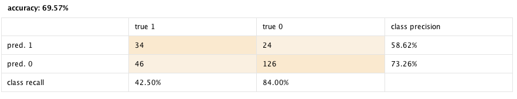
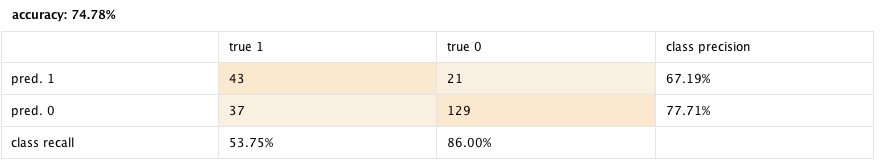

# Quiz
### Classification Lab | Pima Indians Diabetes Dataset

ข้อมูลชุด “Pima Indians Diabetes” เป็นข้อมูลการเป็นโรคเบาหวานที่สามารถดาวน์โหลดได้จาก http://tinyurl.com/CU-RapidMiner 

**แบบฝึกหัด** นี้มีเป้าหมายในการสร้างแบบจำลองทำนายประเภทคนไข้ (Classification) ว่ารายใดมีโอกาส “ไม่เป็น” หรือ “เป็น” โรคเบาหวาน (0, 1) ในข้อมูลชุดนี้ประกอบไปด้วยคนไข้ 768 คน มีตัวแปรต้นทั้งหมด 8 ตัวแปร มีตัวแปรเป้าหมาย 1 ตัวแปร และมีตัวแปรรหัสคนไข้ 1 ตัวแปร (ID) ดังแสดงด้านล่าง ซึ่งรายการข้อมูลขาดหายในข้อมูลชุดนี้จะถูกแทนที่ด้วย 0 ดังนั้นในการเตรียมข้อมูลต้องเปลี่ยน 0 ให้กลับมาเป็น missing

1. PatientID [polynominal; id]
2. Number of times pregnant [integer]
3. Plasma glucose concentration a 2 hour in an oral glucose tolerance test [integer]
4. Diastolic blood pressure (mm Hg) [integer]
5. Triceps skinfold thickness (mm) [integer]
6. 2-Hour serum insulin (mu U/ml) [real]
7. Body mass index (weight in kg/(height in m)2) [real]
8. Diabetes pedigree function [real]
9. Age (years) [integer]
10. Class variable (0 or 1) [binominal; label]

จงนำเข้าข้อมูลชุดนี้ แล้วใช้ Rapid Miner ในเตรียมข้อมูลดังขั้นตอนด้านล่าง

1. แทนที่ 0 ด้วย missing
2. แทนที่ missing ด้วยค่าเฉลี่ย
3. แบ่ง train และ test ด้วยสัดส่วน 70%:30% ด้วยค่า random seed 1992

จากนั้นให้สร้างแบบจำลองข้อมูลดังแสดงด้านล่าง 
1. Decision Tree ซึ่งต้องมีการปรับ Criterion=gini_index และ Maximal depth=5 โดยหากปรับได้ถูกต้อง จะต้องได้ผลลัพธ์ดังแสดงด้านล่าง

  

2. Logistic Regression โดยไม่ต้องปรับแก้ค่าใด ๆ ซึ่ง จะต้องได้ผลลัพธ์ดังแสดงด้านล่าง

  

3. Neural Networks ซึ่งต้องมีการปรับ learning rate=0.01 และกำหนด random seed=1992 โดยหากปรับได้ถูกต้อง จะต้องได้ผลลัพธ์ดังแสดงด้านล่าง

  

ซึ่งเมื่อทำครบทุกขั้นตอนแล้วจะได้ diagram สุดท้ายดังแสดงในรูปด้านล่าง

