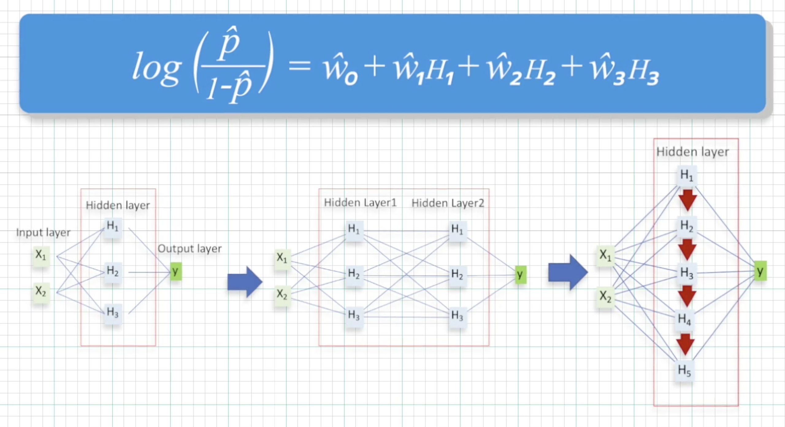

# Supervised Learning
บทนี้จะมาเรียนเรื่อง **Predictive Tasks**

### ชนิดของตัวแปร
1. **Numerical** หรือ **Interval** คือ ตัวแปรที่เป็นตัวเลขที่มีความต่อเนื่อง เช่น อายุ จำนวนเงิน
2. **Categorical** คือ ตัวแปรที่มีค่าเป็นกลุ่มๆ แบ่งเป็น 2 แบบ คือ
   * **Nominal** คือ ตัวแปรที่มีค่าที่**ไม่สามารถ**นำมาเปรียบเทียบกันได้ เช่น สี
   * **Ordinal** คือ ตัวแปรที่มีค่าที่**สามารถ**นำมาเปรียบเทียบกันได้ เช่น ขนาด Size เสื้อ

### หน้าตาของข้อมูล
ข้อมูลจะต้องอยู่ในรูปของ **Data table** ก่อนการทำการวิเคราะห์ข้อมูล

**Data table** ประกอบด้วย **Row** กับ **Column**
* **Row** ประกอบไปด้วย Instance
* **Column** ประกอบไปด้วย Variable โดยที่ Variable มี 2 ชนิด คือ 
  1. Input หรือ Predictor
  2. Output หรือ Label หรือ Target

### Predictive Tasks
Predictive Tasks ประกอบด้วย 2 Process
1. **Training** Process สร้างสมการ Prediction จาก Training Data (ประกอบด้วย Input Variable และ Target Variable)

    

2. **Testing** Process นำเอาสมการ Prediction มาทำนาย Testing Data

    

### Prediction Target
แบ่งได้เป็น 2 ประเภทหลักๆ คือ
1. **Classification**

    

    **Example**
    * ค้นหากลุ่มผู้ซื้อ
    * ตรวจจับคนโกง

2. **Regression**

    

    **Example**
    1. ทำนายรายได้
    2. ทำนายราคาสินค้า

### Prediction Example Algorithm
* Decision Tree
* Regression
* Support Vector Machine
* K-Nearest Neighbors (K-NN)
* Neural Networks
* Deep Learning

## Decision Tree
ทำนายคนโกงภาษีจาก Decision Tree

## Regression
* **Linear Regression Equation** : ใช้กับข้อมูลประเภท **Numerical**

  

* **Logistic Regression Equation** : ใช้กับข้อมูลประเภท **Categorical**

  
  

**_ข้อจำกัด_** **Input** และ **Target** จะต้องมีความสัมพันธ์กันแบบ **Linear Relationship** ถึงจะใช้ Regression ได้ !!! **Only**

## Neural Networks
ประกอบด้วย 3 ส่วน คือ
1. Input Layer
2. Hidden Layers ยิ่งเพิ่ม Layers ให้เยอะยิ่งทำให้ไม่เป็น Linear
3. Output Layer

