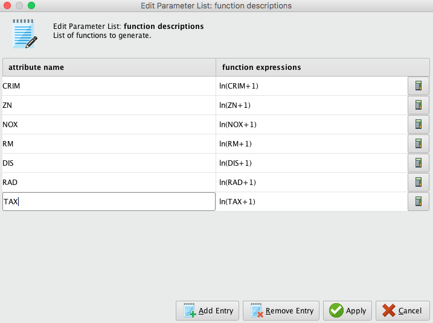

# Quiz
### Regression Lab | Boston House Price Dataset

Reference: https://www.kaggle.com/c/boston-housing

ข้อมูลชุด “boston-housing.csv” เป็นข้อมูลราคาบ้านพร้อมทั้งสภาพของย่านที่บ้านนั้น ๆ ตั้งอยู่ ซึ่งข้อมูลสามารถดาวน์โหลดได้จากลิงค์ด้านล่าง http://tinyurl.com/CU-RapidMiner

ข้อมูลชุดนี้มีเป้าหมายในการทำนายราคาบ้าน (PRICE) ซึ่งมีข้อมูลบ้านทั้งหมด 506 หลัง โดยมีตัวแปรดังแสดงด้านล่าง

1. CRIM: per capita crime rate by town อัตราการเกิดอาชญากรรม
2. ZN: proportion of residential land zoned for lots over 25,000 sq.ft. ความหนาแน่นของประชากร
3. INDUS: proportion of nonretail business acres per town สัดส่วนพื้นที่ ที่ไม่ได้ใช้ในการทำธุรกิจภายในเมือง
4. CHAS: Charles River dummy variable (= 1 if tract bounds river; 0 otherwise) อยู่ติดแม่น้ำหรือไม่ ซึ่งตัวแปรนี้ต้องกำหนดให้เป็น binominal
5. NOX: nitric oxides concentration (parts per 10 million). ความเข้มข้นของก๊าซ NOX
6. RM: average number of rooms per dwelling จำนวนห้องเฉลี่ยต่อบ้านหนึ่งหลังในย่านนั้น ๆ
7. AGE: proportion of owner-occupied units built prior to 1940 สัดส่วนจำนวนบ้านที่สร้างก่อนปี 1940 ในย่านนั้น ๆ
8. DIS: weighted distances to five Boston employment centers ระยะห่างจากบ้านไปยังศูนย์ส่งเสริมอาชีพของ Boston
9. RAD: index of accessibility to radial highways ตัวชี้วัดในการเดินทางไปยัง highways
10. TAX: full-value property-tax rate per $10,000 อัตราภาษีที่ดินต่อราคาบ้าน $10,000
11. B: 1000(Bk – 0.63)2 where Bk is the proportion of blacks by town. สัดส่วนของคนผิวสีในพื้นที่
12. PRICE ราคาบ้านในหน่วย $1,000 

**[Lab1]** จงนำเข้าข้อมูลชุดนี้ แล้วสร้าง Process “BostonHousePrice_Lab1” โดยให้มีขั้นตอนดังต่อไปนี้ ซึ่งจะได้ผลลัพธ์ดังแสดงในรูปด้านล่าง จากนั้นจงตอบคำถามข้อ 1-3

  - แทนที่ 0 ด้วย missing
  - แล้วเติม Missing ด้วยค่าเฉลี่ย
  - เปลี่ยนตัวแปร Nominal ให้เป็น Numeric ในรูปแบบ “dummy coding” และกำหนดให้ comparison groups ของตัวแปร CHAS คือกลุ่มที่มีค่าเป็น 0
  - แบ่งข้อมูลชุด train & test ด้วยค่า default (0.7 และ seed เป็น 1992)
  - จากนั้นใช้โมเดล Linear Regression ในการทำนาย
  - ซึ่งหากถูกต้องจะได้ผลลัพธ์ ควรจะได้ RMSE = 6.046

  
  

**[Lab2]** ขั้นถัดมาจงคัดลอก Process จากขั้นตอนที่ผ่านมาแล้วสร้าง Process “BostonHousePrice_Lab2” โดยการใช้โหนด Generate Attributes เพื่อแก้ไขความ skewness ของตัวแปร inputs โดยการสร้างเพื่อใส่ ln(ตัวแปร + 1) ของตัวแปร inputs ดังต่อไปนี้ CRIM, ZN, NOX, RM, DIS, RAD, TAX ซึ่งจะได้ผลลัพธ์ดังรูปด้านล่าง โดยหากทำได้ถูกต้องจะต้องได้ค่า RMSE = 5.376 จากนั้นจงตอบคำถามข้อ 4-6

  
  

**[Lab3]** ขั้นถัดมาจงคัดลอก Process จากขั้นตอนที่ผ่านมาแล้วสร้าง Process “BostonHousePrice_Lab3” แล้วเปลี่ยนโมเดลทำนายมาเป็น Neural Networks ซึ่งหากถูกต้องจะต้องได้ผลลัพธ์ RMSE = 4.177 จากนั้นจงตอบคำถามข้อ 7-9

**[Lab4]** ขั้นสุดท้าย จงคัดลอก Process จากขั้นตอนที่ผ่านมาแล้วสร้าง Process “BostonHousePrice_Lab4” แล้วกำหนดขอบเขตของผลการทำนายให้อยู่ระหว่าง 11 ถึง 50 ดังแสดงในรูปด้านล่าง (Generate Attributes แล้วใช้ Set Role เพื่อกำหนดบทบาทให้เป็น prediction) ซึ่งหากถูกต้อง RMSE = 3.584 จากนั้นจงตอบคำถามข้อ 1

  
